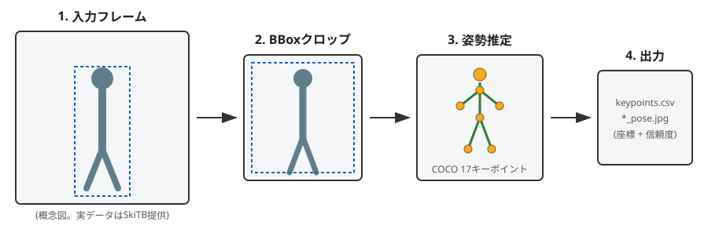

# Ski Jumping Pose Estimation

**[SkiTB (Tracking Skiers from the Top to the Bottom)](https://machinelearning.uniud.it/datasets/skitb/) データセットを用いた、スキージャンプ選手の骨格姿勢推定パイプライン**

卒業研究(スキージャンプのフォームデータ分析、および「富岳」を用いた空力CFD解析)で扱ってきた「選手の姿勢」というテーマを、実際の映像データから機械学習で定量化するソフトウェアとして再構築したプロジェクトです。研究で得た力学的な理解と、AIエンジニアリング(モデル推論パイプラインの実装・データエンジニアリング・テスト)を接続することを目的としています。

| | |
|---|---|
| **現在の状態** | v0.1 — `JP0001` の1フレームで姿勢推定パイプラインが動作確認済み |
| **次のマイルストーン** | `JP0001`〜`JP0100` 全シーケンスへの拡張|
| **対象** | スキージャンプ (`JP`)。データセット自体は他にアルペン (`AL`)・フリースタイル (`FS`) も収録 |

---

## パイプラインの流れ

```
入力フレーム → BBoxクロップ(選手領域を切り出し) → YOLOv8-poseで姿勢推定 → キーポイントCSV・可視化画像を出力
```



---

## なぜこのプロジェクトか

卒業研究では、スキージャンプ選手のフォーム(踏切姿勢・空中姿勢)を空力の観点から分析しました。しかし研究時点では、姿勢データの多くはモーションキャプチャの出力に依存しており、「映像から姿勢を自動抽出するパイプライン自体を自分で実装する」という経験がありませんでした。

このプロジェクトは、その部分を実際にゼロから実装し、

- **AIエンジニアリング**: 物体検出・姿勢推定モデルの推論パイプライン設計、前処理(BBoxクロップ)による精度改善、モデル選定と限界の把握
- **データサイエンス**: フレーム単位のキーポイント時系列から、V字角度・前傾角度などの力学的特徴量を抽出し、CFD解析結果と接続する
- **クラウド/インフラ**: 58シーケンス規模のバッチ推論をスケーラブルに実行する設計

の3軸を横断して技術力を示すことを目指しています。

---

## 使用技術

| カテゴリ | 技術 | 採用理由 |
|---|---|---|
| 言語 / パッケージ管理 | Python 3.12 + [uv](https://docs.astral.sh/uv/) | `pip`+`venv`より高速で、`pyproject.toml`一本で依存関係とPythonバージョンを一元管理できる |
| 姿勢推定 | [Ultralytics YOLOv8-pose](https://docs.ultralytics.com/tasks/pose/)(`yolov8n-pose`) | 単一ステージで人物検出+17キーポイント推定を行える実装が容易なベースライン。軽量モデルから始め、精度検証のうえで大きいモデルやファインチューニングへ移行する方針 |
| 画像処理 | OpenCV | BBoxクロップ・描画 |
| データ処理 | pandas | キーポイント時系列の集計・特徴量抽出(拡張予定) |
| テスト | pytest | アノテーションパーサ・クロップ処理のユニットテスト |
| Lint | ruff | コード品質の担保 |

---

## リポジトリ構成

```
ski-pose-estimation/
├── README.md
├── pyproject.toml          # 依存関係・ビルド設定 (uv管理)
├── uv.lock                 # 依存関係ロックファイル
├── .python-version         # プロジェクト固定のPythonバージョン
├── data/
│   ├── JP0001/
│   │   ├── frames/         # フレーム画像(各自ローカルに配置、下記License参照)
│   │   ├── MC/             # cameras.txt / frames.txt / visibilities.txt
│   │   └── SC/             # boxes.txt / frames.txt / visibilities.txt
│   ├── JP_data.csv                  # シーケンス単位メタデータ(選手・会場・天候など)
│   ├── JP_visual_attributes.csv     # SCクリップ単位の視覚的困難度属性
│   └── JP_train_(val_)test_*.json   # train/(val)/test 分割定義 (date/athlete/course, 計6ファイル)
├── src/
│   ├── __init__.py
│   ├── dataset.py          # SkiTBアノテーション(MC/SC)のパーサ
│   ├── metadata.py         # メタデータ・split・視覚属性の統合ローダー
│   ├── crop.py             # BBoxクロップ・マージン付与
│   ├── pose.py             # YOLOv8-poseラッパー
│   └── visualize.py        # キーポイント・骨格の描画
├── scripts/
│   ├── run_pose_estimation.py      # CLIエントリポイント(姿勢推定)
│   └── build_dataset_manifest.py   # メタデータ統合マニフェスト生成
├── assets/
│   └── pipeline_diagram.svg   # README掲載用の自作概念図
├── outputs/                # 推論結果の出力先
└── tests/
    ├── test_dataset.py
    └── test_metadata.py
```

---

## セットアップ

### 前提

- [uv](https://docs.astral.sh/uv/getting-started/installation/) がインストールされていること(`curl -LsSf https://astral.sh/uv/install.sh | sh`)。uvが未インストールでも、後続の`uv run`が自動でPython本体とライブラリ一式を用意するため、事前に別途Pythonをインストールする必要はありません。

### 手順

```bash
# 1. リポジトリを取得
git clone <https://github.com/uta20/skitb-pose-estimation>
cd skitb-pose-estimation

# 2. 依存関係を同期(pyproject.toml / uv.lock を元に .venv を自動構築)
uv sync

# 3. 動作確認(ユニットテスト)
uv run pytest -q

# 4. 姿勢推定を実行(同梱サンプルフレームに対して)
uv run scripts/run_pose_estimation.py --sequence JP0001
```

`uv sync`は`.python-version`に指定されたPythonバージョン(3.12)を必要に応じて自動取得し、`pyproject.toml`の依存関係を解決した上で`uv.lock`に固定し、プロジェクト専用の仮想環境(`.venv`)へインストールします。
以降は`uv run <コマンド>`とするだけで、常にこの固定環境でコードが実行されます(`source .venv/bin/activate`は不要)。

初回の`run_pose_estimation.py`実行時には、YOLOv8-poseの学習済み重み(`yolov8n-pose.pt`, 約6.5MB)がUltralytics公式リポジトリから自動ダウンロードされます。

### 依存関係を追加する場合

```bash
uv add <パッケージ名>        # 通常の依存関係
uv add --group dev <パッケージ名>  # 開発用依存関係(テスト・Lint等)
```

`uv add`は`pyproject.toml`と`uv.lock`を自動更新するため、`requirements.txt`を手動管理する必要がありません。

---

## 使い方

```bash
# シーケンス内の利用可能な全フレームを処理
uv run scripts/run_pose_estimation.py --sequence JP0001

# 特定フレームのみ処理
uv run scripts/run_pose_estimation.py --sequence JP0001 --frame 63

# クロップ時のマージンやモデルを変更
uv run scripts/run_pose_estimation.py --sequence JP0001 --margin 0.3 --model yolov8s-pose.pt
```

出力は `outputs/<sequence>/` 以下に、

- `<frame_id>_pose.jpg`: キーポイント可視化画像
- `keypoints.csv`: 全フレームのキーポイント座標・信頼度

として保存されます。

---
## メタデータ・train/test分割の活用

SkiTB公式配布物には、映像アノテーション(`MC/`, `SC/`)とは別に、シーケンス単位のメタデータと3種類の分割基準(選手・会場・日付、それぞれ2-way / 3-way)が含まれています。これらを`src/metadata.py`で統合的に扱えるようにしました。

| ファイル | 内容 | 行数(JPカテゴリ) |
|---|---|---|
| `JP_data.csv` | 選手名・国籍・大会会場・K点/HS・天候・採点・結果など、シーケンス単位の属性 | 100行(=JP0001〜JP0100) |
| `JP_visual_attributes.csv` | SCクリップ(カメラ単位)ごとの視覚的困難度10属性(SC/ARC/LR/FM/CM/FOC/POC/IV/BC/MB)。**dateスプリットのtest集合(40シーケンス)にのみ存在** | 140行(=SCクリップ数) |
| `*_train_test_{date,athlete,course}_60-40.json` | train/testの2-way分割定義 | 各60/40件 |
| `*_train_val_test_{date,athlete,course}_60-40.json` | train/val/testの3-way分割定義 | 分割毎に件数が異なる |


## ロードマップ

- [x] **v0.1**: `JP0001`のアノテーション(MC)パーサ・BBoxクロップ・YOLOv8-pose推論・可視化・CSV出力までの一連のパイプラインを実装し、単一フレームで動作確認
- [ ] **v0.1.1**: `JP_data.csv`・`JP_visual_attributes.csv`・6種類のtrain/val/test分割定義を統合するメタデータモジュールとマニフェスト生成スクリプトを実装(全100シーケンス対応を確認)
- [ ] **v0.2**: `frames/`ディレクトリに全フレームを配置し、`JP0001`の全317フレーム(3カメラ切り替えを含む)を通しで処理。カメラ切り替え点でのBBox不連続への対処
- [ ] **v0.3**: `JP0002`〜`JP0100`へバッチ処理を拡張(`data/`直下のsplit定義を用いて優先順位づけ)。`visibilities.txt`が`0`のフレーム(選手が50%以上隠れている)を除外した評価パイプラインの整備
- [ ] **v0.4**: キーポイントから力学的特徴量(踏切時の前傾角度、空中姿勢のV字角度、体幹の左右対称性など)を抽出し、卒業研究のCFD解析結果(揚力・抗力係数)と突き合わせる分析ノートブックを追加
- [ ] **v0.5**: 精度評価(SkiTBの可視性ラベルを正解として、検出失敗率・キーポイント信頼度の分布を定量化)を行い、必要に応じてスキー特有の姿勢に対するファインチューニングを実施
- [ ] **将来検討**: 100シーケンス規模のバッチ推論をクラウド上のジョブ(例: コンテナ化してGPUインスタンス/バッチサービス上で並列実行)として構成し、スケーラブルな推論基盤としての設計を検討

---

## データセットについて・ライセンス

本リポジトリのコード(`src/`, `scripts/`, `tests/`)は [MIT License](https://opensource.org/licenses/MIT) の下で公開しています。

一方、**SkiTBデータセット自体(アノテーション・映像フレーム)は本リポジトリのコードとは別ライセンスです**。SkiTBは [Creative Commons Attribution-NonCommercial 4.0 International License](https://creativecommons.org/licenses/by-nc/4.0/) の下で提供されており、研究目的のみに利用可能で商用利用はできません。このため、

- 本リポジトリには `JP0001` のアノテーションファイル(`MC/*.txt`)のみを同梱しており、**動画フレーム画像(JPG)は一切コミットしていません**。理由は、公式ライセンス文言が「annotation files」に限定されており、TV中継映像から抽出されたフレーム画像自体への権利許諾を明言していないためです。画像フレームは[SkiTB公式サイト](https://machinelearning.uniud.it/datasets/skitb/)から各自取得し、`data/JPxxxx/frames/`配下に配置してください(`.gitignore`で除外済み)。
- `data/`直下のシーケンス単位メタデータ(`JP_data.csv`)・視覚属性(`JP_visual_attributes.csv`)・train/test分割定義(`JP_train_(val_)test_*.json`)は、公式配布物における「アノテーションファイル」に該当するため同じCC BY-NC 4.0の下で同梱しています。映像フレーム本体は含めていません。
- フルデータセット(全100シーケンス分の映像フレーム)は [SkiTB公式サイト](https://machinelearning.uniud.it/datasets/skitb/) から別途取得してください。

利用の際は以下を引用してください:

```bibtex
@InProceedings{SkiTBwacv,
  author = {Dunnhofer, Matteo and Sordi, Luca and Martinel, Niki and Micheloni, Christian},
  title = {Tracking Skiers from the Top to the Bottom},
  booktitle = {Proceedings of the IEEE/CVF Winter Conference on Applications of Computer Vision (WACV)},
  month = {Jan},
  year = {2024}
}
```

---

## テスト

```bash
uv run pytest -q
```

現時点では、アノテーションパーサ(`dataset.py`)・メタデータ統合(`metadata.py`)・BBoxマージン処理(`crop.py`)に対するユニットテストを用意しています。フレーム画像を用いたテストは、現状ローカルに配置しているJP0001の最初のフレーム(frame 63, Git管理外)のみを対象にしています。JP0001全317フレーム・JP0002〜JP0100を用いた通しでの動作確認は、リポジトリを公開した後に別途行う予定です(`v0.2`以降のロードマップ参照)。姿勢推定モデル自体の推論精度に対する回帰テスト(期待値画像との比較など)は`v0.5`で整備予定です。

---

## 作者

Machine Learning and Perception Lab (University of Udine) の SkiTB データセットを利用しています。
本リポジトリの実装・分析は個人のポートフォリオ・研究目的として作成しています。
