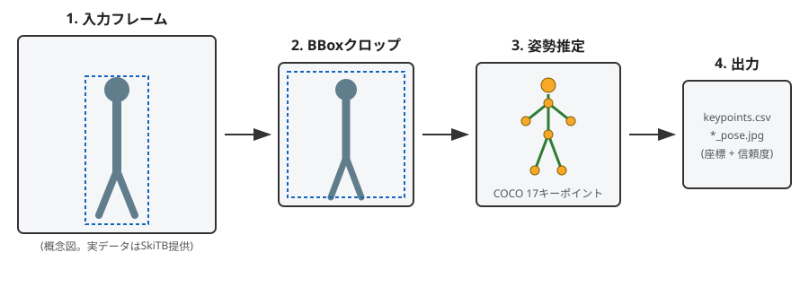

# Ski Jumping Pose Estimation

**[SkiTB (Tracking Skiers from the Top to the Bottom)](https://machinelearning.uniud.it/datasets/skitb/) データセットを用いた、スキージャンプ選手の骨格姿勢推定パイプライン**

卒業研究(スキージャンプのフォームデータ分析、および「富岳」を用いた空力CFD解析)で扱ってきた「選手の姿勢」というテーマを、実際の映像データから機械学習で定量化するソフトウェアとして再構築したプロジェクトです。研究で得た力学的な理解と、AIエンジニアリング(モデル推論パイプラインの実装・データエンジニアリング・テスト)を接続することを目的としています。

| | |
|---|---|
| **現在の状態** | v0.5 — `JP0001`〜`JP0100`(100シーケンス)で姿勢推定を実行し, 実測の検出率(全体70.6%)・可視性ラベルとの照合によるrecall(71.5%)を確認([結果を見る](#実行結果)). キーポイントからの力学的特徴量抽出も実装済み([詳細](#キーポイントからの力学的特徴量抽出)) |
| **次のマイルストーン** | 卒業研究のCFD解析結果(揚力係数, 抗力係数)との突き合わせ|
| **対象** | スキージャンプ (`JP`). データセット自体は他にアルペン (`AL`)・フリースタイル (`FS`) も収録 |

---

## パイプラインの流れ

```
入力フレーム → BBoxクロップ(選手領域を切り出し) → YOLOv8-poseで姿勢推定 → キーポイントCSV・可視化画像を出力
```



---

## なぜこのプロジェクトか

卒業研究では、スキージャンプ選手のフォーム(踏切姿勢・空中姿勢)を空力の観点から分析しました。しかし研究時点では、姿勢データの多くはモーションキャプチャの出力に依存しており、「映像から姿勢を自動抽出するパイプライン自体を自分で実装する」という経験がありませんでした。

このプロジェクトは、その部分を実際にゼロから実装し、

- **AIエンジニアリング**: 物体検出・姿勢推定モデルの推論パイプライン設計、前処理(BBoxクロップ)による精度改善、モデル選定と限界の把握
- **データサイエンス**: フレーム単位のキーポイント時系列から、V字角度・前傾角度などの力学的特徴量を抽出し、CFD解析結果と接続する
- **クラウド/インフラ**: 58シーケンス規模のバッチ推論をスケーラブルに実行する設計

の3軸を横断して技術力を示すことを目指しています。

---

## 使用技術

| カテゴリ | 技術 | 採用理由 |
|---|---|---|
| 言語 / パッケージ管理 | Python 3.12 + [uv](https://docs.astral.sh/uv/) | `pip`+`venv`より高速で、`pyproject.toml`一本で依存関係とPythonバージョンを一元管理できる |
| 姿勢推定 | [Ultralytics YOLOv8-pose](https://docs.ultralytics.com/tasks/pose/)(`yolov8n-pose`) | 単一ステージで人物検出+17キーポイント推定を行える実装が容易なベースライン。軽量モデルから始め、精度検証のうえで大きいモデルやファインチューニングへ移行する方針 |
| 画像処理 | OpenCV | BBoxクロップ・描画 |
| データ処理 | pandas | キーポイント時系列の集計・特徴量抽出(拡張予定) |
| 進捗表示 | tqdm | 全シーケンスバッチ処理時の進捗バー表示 |
| テスト | pytest | アノテーションパーサ・パイプライン・クロップ処理のユニットテスト |
| Lint | ruff | コード品質の担保 |

> **モデル選定について**: YOLOv8-poseはCOCOデータセット(日常動作の人物)で学習されており、スキージャンプの空中姿勢(前傾・V字開脚)のような競技特有の極端な姿勢は学習分布から外れています。本プロジェクトでは、まずこのCOCO学習済みモデルをベースラインとして導入し、後述の評価を通じて精度の限界を定量化したうえで、ドメイン特化のファインチューニングを検討する、という段階的なアプローチを採っています(詳細はロードマップ参照)。

---

## リポジトリ構成

```
ski-pose-estimation/
├── README.md
├── pyproject.toml          # 依存関係・ビルド設定 (uv管理)
├── uv.lock                 # 依存関係ロックファイル
├── .python-version         # プロジェクト固定のPythonバージョン
├── data/
│   ├── JP0001/
│   │   ├── frames/         # フレーム画像(各自ローカルに配置、下記License参照)
│   │   ├── MC/             # cameras.txt / frames.txt / visibilities.txt
│   │   └── SC/             # boxes.txt / frames.txt / visibilities.txt
│   ├── JP_data.csv                  # シーケンス単位メタデータ(選手・会場・天候など)
│   ├── JP_visual_attributes.csv     # SCクリップ単位の視覚的困難度属性
│   └── JP_train_(val_)test_*.json   # train/(val)/test 分割定義 (date/athlete/course, 計6ファイル)
├── src/
│   ├── __init__.py
│   ├── dataset.py          # SkiTBアノテーション(MC/SC)のパーサ
│   ├── evaluation.py       # 検出率, 信頼度の評価
│   ├── crop.py             # BBoxクロップ・マージン付与
│   ├── features.py         # キーポイントから力学的特徴量(相対角度)を抽出
│   ├── metadata.py         # メタデータ・split・視覚属性の統合ローダー
│   ├── pipeline.py         # 1シーケンス分の姿勢推定処理(CLIから独立、単一/バッチ両対応)
│   ├── pose.py             # YOLOv8-poseラッパー
│   └── visualize.py        # キーポイント・骨格の描画
├── scripts/
│   ├── analyze_detection_results.py # 実行結果(summary.csv)・manifest・視覚属性を突き合わせた
│   ├── build_dataset_manifest.py   # メタデータ統合マニフェスト生成
│   ├── evaluate_accuracy.py         # 信頼度分布の集計
│   ├── extract_features.py         # keypoints.csvから力学的特徴量
│   └── run_pose_estimation.py      # CLIエントリポイント(単一/複数/全シーケンス対応)
├── assets/
│   └── pipeline_diagram.svg   # README掲載用の自作概念図
├── outputs/                # 推論結果の出力先
└── tests/
    ├── test_dataset.py
    ├── test_evaluation.py
    ├── test_metadata.py
    ├── test_pipeline.py
    └── test_features.py
```

---

## セットアップ

### 前提

- [uv](https://docs.astral.sh/uv/getting-started/installation/) がインストールされていること(`curl -LsSf https://astral.sh/uv/install.sh | sh`)。uvが未インストールでも、後続の`uv run`が自動でPython本体とライブラリ一式を用意するため、事前に別途Pythonをインストールする必要はありません。

### 手順

```bash
# 1. リポジトリを取得
git clone <https://github.com/uta20/skitb-pose-estimation>
cd skitb-pose-estimation

# 2. 依存関係を同期(pyproject.toml / uv.lock を元に .venv を自動構築)
uv sync

# 3. 動作確認(ユニットテスト)
uv run pytest -q

# 4. 姿勢推定を実行(同梱サンプルフレームに対して)
uv run scripts/run_pose_estimation.py --sequence JP0001
```

`uv sync`は`.python-version`に指定されたPythonバージョン(3.12)を必要に応じて自動取得し、`pyproject.toml`の依存関係を解決した上で`uv.lock`に固定し、プロジェクト専用の仮想環境(`.venv`)へインストールします。
以降は`uv run <コマンド>`とするだけで、常にこの固定環境でコードが実行されます(`source .venv/bin/activate`は不要)。

初回の`run_pose_estimation.py`実行時には、YOLOv8-poseの学習済み重み(`yolov8n-pose.pt`, 約6.5MB)がUltralytics公式リポジトリから自動ダウンロードされます。

### 依存関係を追加する場合

```bash
uv add <パッケージ名>        # 通常の依存関係
uv add --group dev <パッケージ名>  # 開発用依存関係(テスト・Lint等)
```

`uv add`は`pyproject.toml`と`uv.lock`を自動更新するため、`requirements.txt`を手動管理する必要がありません。

---

## 使い方

```bash
# シーケンス内の利用可能な全フレームを処理
uv run scripts/run_pose_estimation.py --sequence JP0001

# 特定フレームのみ処理
uv run scripts/run_pose_estimation.py --sequence JP0001 --frame 63

# クロップ時のマージンやモデルを変更
uv run scripts/run_pose_estimation.py --sequence JP0001 --margin 0.3 --model yolov8s-pose.pt

# 複数シーケンスをカンマ区切りで指定
uv run scripts/run_pose_estimation.py --sequence JP0001,JP0002,JP0003

# data/ 直下で検出できる全シーケンス(JP0001〜JP0100)を一括処理
uv run scripts/run_pose_estimation.py --sequence all

# 動作確認のため、全件のうち先頭5シーケンスだけに絞って試す
uv run scripts/run_pose_estimation.py --sequence all --limit 5

# 可視化画像の保存を省略しCSV出力のみに絞る(大量データの高速化)
uv run scripts/run_pose_estimation.py --sequence all --no-images
```

出力は `outputs/<sequence>/` 以下に、

- `<frame_id>_pose.jpg`: キーポイント可視化画像(`--no-images`指定時は省略)
- `keypoints.csv`: 各シーケンスのキーポイント座標・信頼度

として保存される。2件以上のシーケンスを処理した場合は、`outputs/summary.csv`に全シーケンス分の処理結果(フレーム数・検出率・エラー有無)がまとめて出力され、どのシーケンスで検出に失敗しているかを一覧で確認可能

処理ロジック本体は`src/pipeline.py`の`process_sequence()`に切り出してあり、CLIスクリプトはシーケンスの選び方(単一/カンマ区切り/`all`)を解釈してループを回すだけの薄いラッパー. ノートブックや別スクリプトから直接呼び出しも可能

---
## メタデータ・train/test分割の活用

SkiTB公式配布物には、映像アノテーション(`MC/`, `SC/`)とは別に、シーケンス単位のメタデータと3種類の分割基準(選手・会場・日付、それぞれ2-way / 3-way)が含まれています。これらを`src/metadata.py`で統合的に扱えるようにしました。

| ファイル | 内容 | 行数(JPカテゴリ) |
|---|---|---|
| `JP_data.csv` | 選手名・国籍・大会会場・K点/HS・天候・採点・結果など、シーケンス単位の属性 | 100行(=JP0001〜JP0100) |
| `JP_visual_attributes.csv` | SCクリップ(カメラ単位)ごとの視覚的困難度10属性(SC/ARC/LR/FM/CM/FOC/POC/IV/BC/MB)。**dateスプリットのtest集合(40シーケンス)にのみ存在** | 140行(=SCクリップ数) |
| `*_train_test_{date,athlete,course}_60-40.json` | train/testの2-way分割定義 | 各60/40件 |
| `*_train_val_test_{date,athlete,course}_60-40.json` | train/val/testの3-way分割定義 | 分割毎に件数が異なる |

### 何ができるか
 
```bash
uv run scripts/build_dataset_manifest.py
```
 
このスクリプトは
 
1. `JP_data.csv`に6種類のsplit(date/athlete/course × 2way/3way)の所属(train/val/test)を列として結合
2. `JP_visual_attributes.csv`をシーケンス単位に集約(いずれかのカメラで視覚属性が真なら、そのシーケンス全体として該当ありとみなす)
3. 両者を統合した`outputs/manifest.csv`(1行1シーケンス、100行)を生成
を行い、「date-split の test 集合のうち、完全遮蔽(FOC)・部分遮蔽(POC)・モーションブラー(MB)を含まないシーケンス」を姿勢推定パイプラインの拡張候補として抽出する例も含む。**視覚属性はSCクリップ単位でしか提供されていない(＝現状は40シーケンス分のみ)ため、この絞り込みが使えるのはdate-splitのtest集合のみ**という制約に注意。
 
このマニフェストは、`JP0001`単体から`JP0002`〜`JP0100`へ姿勢推定を拡張する際に「どのシーケンスから着手すべきか」(視覚的に易しいものから優先する/特定の分割戦略のtest集合だけ先に処理するなど)を判断する材料として使う想定。

---

## キーポイントからの力学的特徴量抽出

`src/features.py`は、YOLOv8-poseが出力するCOCO 17キーポイントから、卒業研究(スキージャンプのフォーム・CFD解析)と接続しやすい**体の部位同士の相対角度**を計算する

| 特徴量 | 定義 | 意味 |
|---|---|---|
| `trunk_hip_angle_deg` | 肩の中点→腰の中点→膝の中点でできる角 | 体幹がどれだけ「くの字」に折れているか. 180°に近いほど直立 |
| `leg_v_angle_deg` | 腰から見た左足首, 右足首へのベクトルのなす角 | スキー板のV字開脚角度の近似値 |
| `left_knee_angle_deg` / `right_knee_angle_deg` | 腰-膝-足首でできる角(左右別) | 脚の伸展度合い(180°=伸展) |
| `knee_asymmetry_deg` | 左右の膝角度の差の絶対値 | 空中姿勢の左右非対称さ・崩れの指標 |

### 設計上の注意: なぜ「相対角度」に限定したか

SkiTBのカメラは選手を追って常にパン/チルトしており, 画像の上方向が実世界の鉛直方向と一致しない. そのため, **画像座標の絶対角度は、同じ実際の姿勢でもカメラワークによって値が変わってしまう**. 本モジュールでは体の部位同士の相対角度を用いることで, この問題を回避している. 真の対気角度(angle of attack)を得るにはカメラキャリブレーションによる3次元復元が必要だが, これは本プロジェクトのスコープ外とする. 

### 使い方

```bash
# 1. 姿勢推定でkeypoints.csvを生成
uv run scripts/run_pose_estimation.py --sequence JP0001

# 2. keypoints.csvから特徴量を計算
uv run scripts/extract_features.py --sequence JP0001
```

`outputs/<sequence>/features.csv`に、フレームごとの各角度が出力される`--sequence`は他のスクリプトと同様にカンマ区切り複数・`all`にも対応している

サンプルフレーム(JP0001, frame 63, 踏切前の助走姿勢)での実際の出力例:

| trunk_hip_angle | leg_v_angle | left_knee_angle | right_knee_angle | knee_asymmetry |
|---|---|---|---|---|
| 176.1° | 30.6° | 175.4° | 167.3° | 8.1° |

体幹角176°・V字角31°・膝角167〜175°という結果は, 踏切前の直立姿勢という実際のフレーム内容と整合しており, 特徴量の妥当性を裏付けている

### テスト

`tests/test_features.py`では, 角度があらかじめ分かっている合成キーポイント(直角・直線などのキリの良い配置)を用いて計算結果が幾何学的に正しいことを検証している(信頼度不足のキーポイントを未検出として扱う分岐、キーポイント自体が無い場合にNoneを返す分岐も含む). 

--- 

## ロードマップ

- [x] **v0.1**: `JP0001`のアノテーション(MC)パーサ・BBoxクロップ・YOLOv8-pose推論・可視化・CSV出力までの一連のパイプラインを実装し, 単一フレームで動作確認. 
- [x] **v0.1.1**: `JP_data.csv`・`JP_visual_attributes.csv`・6種類のtrain/val/test分割定義を統合するメタデータモジュールとマニフェスト生成スクリプトを実装(全100シーケンス対応を確認). 
- [x] **v0.2**: 処理ロジックを`src/pipeline.py`に切り出し、`scripts/run_pose_estimation.py`を単一/複数(カンマ区切り)/全シーケンス(`--sequence all`)対応のバッチ処理CLIに拡張. `src/dataset.py`にシーケンス自動検出(`discover_sequences`)を追加し, `outputs/summary.csv`で全シーケンスの検出率を一覧確認できるようにした. 
- [x] **v0.2.1**: `scripts/analyze_detection_results.py`を実装. `outputs/summary.csv`・`outputs/manifest.csv`・視覚属性を突き合わせ, 視覚属性別/天候別/会場別の検出率や下位シーケンスを分析する機能を整備(`outputs/detection_analysis.csv`に保存). 
- [x] **v0.3**: `JP0001`〜`JP0100`を実際にバッチ処理し, `analyze_detection_results.py`による実測の検出率・傾向をREADME「実行結果」節に反映(全体検出率70.6%, LR/FMが最大の低下要因と判明). 
- [x] **v0.4**: `src/features.py`により, キーポイントから力学的特徴量(体幹の折れ角・脚のV字角・左右膝の伸展角・左右非対称度)を抽出する機能を実装. カメラがパン/チルトし画像の上方向が実世界の鉛直方向と一致しないため, 絶対角度ではなく体の部位同士の**相対角度**のみを採用. `scripts/extract_features.py`で`keypoints.csv`から`features.csv`を生成可能に
- [x] **v0.5**: `src/evaluation.py`・`scripts/evaluate_accuracy.py`を実装し, SkiTBの可視性ラベルとの混同行列(recall 71.5% / precision 99.7%)・関節別の信頼度分布を全100シーケンスで算出. 顔まわり(耳・目)の信頼度が低い一方, v0.4の特徴量が使う関節(肩・腰・膝・足首)への影響は限定的であることを確認. 全面的なファインチューニングよりも, 低解像度・高速動作を狙った追加データ収集を優先する方針とした. 
- [ ] **将来検討**: 100シーケンス規模のバッチ推論をクラウド上のジョブ(例: コンテナ化してGPUインスタンス/バッチサービス上で並列実行)として構成し, スケーラブルな推論基盤としての設計を検討. 

---

## 実行結果
 
`JP0001`〜`JP0100`のフルデータに対して`uv run scripts/run_pose_estimation.py --sequence all`を実行した実測結果です. 以下を実行すれば`outputs/detection_analysis.csv`として再生成できます. 
 
 ```bash
uv run scripts/build_dataset_manifest.py
uv run scripts/run_pose_estimation.py --sequence all --no-images
uv run scripts/analyze_detection_results.py
```

| 指標 | 値 |
|---|---|
| 対象シーケンス数 | **100 / 100**|
| 総フレーム数 | 38,201フレーム |
| 検出できたフレーム数 | 26,692フレーム |
| 全体の検出率(フレーム単位の加重平均) | **70.6%** |
| シーケンス単位の平均検出率 | 70.8%(中央値 72.6%、標準偏差 15.9pt) |

> シーケンスごとに処理フレーム数が異なる(317〜481フレーム)ため, 「フレーム単位の加重平均」と「シーケンス単位の単純平均」の両方を載せている. 標準偏差 約16ptから分かる通り, シーケンス間で検出率に大きな差がある. 

### train/testスプリット別の検出率
 
3種類の分割基準いずれでも, train/test間に大きな差はない(誤差数%程度). 
 
| 分割基準 | train | test |
|---|---|---|
| date | 72.2% (n=59) | 68.7% (n=40) |
| athlete | 70.4% (n=58) | 71.3% (n=41) |
| course | 70.9% (n=61) | 70.6% (n=38) |
 
YOLOv8-poseはファインチューニングしていない(COCO学習済みのまま)ため、この結果は「train/testの分け方による差」ではなく「そもそもモデルが一度も学習していないドメインに対するゼロショット性能のばらつき」を反映していると解釈. 

### 視覚属性別の検出率(date-splitのtest集合40件のみ)
 
視覚属性はdate-splitのtest集合にしか付与されていないため、この40シーケンスに限った集計.**Low Resolution(低解像度)とFast Motion(高速な動き)の影響が最も大きく**, 完全遮蔽(FOC)よりも検出率への影響が大きいという結果となった. 
 
| 属性 | 該当あり | 該当なし | 差 |
|---|---|---|---|
| LR(低解像度) | 56.1% (n=15) | 76.2% (n=25) | **-20.1pt** |
| FM(高速な動き) | 61.1% (n=25) | 81.4% (n=15) | **-20.3pt** |
| CM(カメラの動き) | 64.8% (n=23) | 74.0% (n=17) | -9.2pt |
| IV(照明変化) | 62.9% (n=15) | 72.1% (n=25) | -9.2pt |
| BC(背景の複雑さ) | 66.9% (n=31) | 74.9% (n=9) | -8.0pt |
| FOC(完全遮蔽) | 58.4% (n=6) | 70.5% (n=34) | -12.1pt |
| MB(モーションブラー) | 67.9% (n=26) | 70.1% (n=14) | -2.2pt |
 
「選手が隠れているかどうか」よりも「**選手が小さく/速く映っているかどうか**」の方がCOCO学習済みモデルにとっては課題になりやすい傾向がある. これはスキージャンプ特有の高速滑走・望遠カメラワークを考えると直感的にも納得できる結果である. 

### 会場別の傾向
 
検出率が高い会場の上位は**Ljubno(女子ワールドカップ会場、K点94m)が独占**しており, `JP0001`(Sara Takanashi, 95.9%)を含む上位5件中4件がLjubno開催であった. 一方, 下位にはGarmischPartenkirchen・Lahti・Willingenなど大型ヒル(HS130〜142クラス)の会場が並んでいる. 会場の規模(K点・HS値)とカメラの画角・選手の相対的な大きさが検出率に影響している可能性がある. 

### 検出率が低かったシーケンス(下位5件)
 
| シーケンス | 選手 | 会場 | 天候 | 検出率 |
|---|---|---|---|---|
| JP0020 | Robert Johansson | Lahti | Fog | 28.3% |
| JP0085 | Timi Zajc | Oberstdorf | Clear | 34.3% |
| JP0083 | AnnaOdine Stroem | Zao | Fog | 34.9% |
| JP0014 | Stefan Kraft | Oberstdorf | Snowing | 38.6% |
| JP0066 | Domen Prevc | Vikersund | LowClouds | 40.2% |

Fog・Snowing・LowCloudsといった悪天候が下位に集中しており, 天候別の集計でもFog(49.7%)・Clouds(48.5%)が最低水準であった(ただしClouds・Rainingはサンプル数1〜5件と少ないため参考値). 

## 精度評価(可視性ラベルとの照合)
 
前節の検出率(detection_rate)は可視性を考慮しない単純な検出割合である. ここでは, SkiTBの`visibilities.txt`(選手が50%以上可視かどうかの0/1ラベル)を手がかりに, 検出結果をより厳密に評価する. 
 
> **注意**: `visibilities.txt`は姿勢推定の正解として設計されたラベルではない. 可視=1でも検出に失敗すること, 可視=0でも実際には検出できることがある. そのため本節の指標は「モデルの正解率」そのものではなく, **可視性ラベルと検出結果の一致度**という近似指標として解釈する. 
 
```bash
uv run scripts/run_pose_estimation.py --sequence all --no-images
uv run scripts/evaluate_accuracy.py --sequence all
```

### 混同行列(可視性ラベル vs 検出結果)
 
| | 検出=True | 検出=False |
|---|---|---|
| **可視=1** | TP(正しく検出) | FN(見逃し) |
| **可視=0** | FP(遮蔽下でも検出) | TN(遮蔽時に未検出) |
 
主指標は **recall = TP / (TP + FN)**(「可視なのに見逃した」フレームの少なさ)とする. これは「実行結果」節で見た検出率(detection_rate = 検出数 / 処理フレーム数)とは異なる指標である. detection_rateは可視性を考慮しない単純な検出割合だが, recallは「本来検出できるはずのフレームのうち実際に検出できた割合」を測るため, より厳密にモデルの能力を評価できる. 
 
| 指標 | 値 |
|---|---|
| recall(見逃し率の逆) | 71.5 % |
| precision | 99.7 % |
| accuracy | 71.6 % |
| 対象フレーム数 | 38,201 |

**precisionが99.7%と極めて高い**ことから, 「遮蔽されているのに誤って検出する」ケースはほとんど無いことが分かる. モデルは遮蔽下では素直に検出を諦めており, 誤検出のリスクは低い. 一方で**recallは71.5%**にとどまっており, 「可視なはずなのに見逃した」フレームが約3割弱存在する. これは前節で確認した通り, 低解像度・高速な動きが主要因であり, 遮蔽そのものよりも影響が大きいという結果と整合する. 

### キーポイント信頼度分布(検出できたフレームのみ)
 
検出できた27,027フレームに限定して, キーポイントごとの信頼度(conf)が低い順トップ5を示す. 
 
| キーポイント | 平均conf | 中央値 | 標準偏差 |
|---|---:|---:|---:|
| right_ear | 0.424610 | 0.368 | 0.279249 | 0.088 |
| left_ear | 0.551667 | 0.614 | 0.287106 | 0.125 |
| right_eye | 0.655917 | 0.783 | 0.326965 | 0.088 |
| left_eye | 0.701873 | 0.866 | 0.321958 | 0.110 |
| right_wrist | 0.714489 | 0.779 | 0.232854 | 0.362 |
 
信頼度が低いキーポイントの上位4つが**すべて顔まわり(耳・目)**という結果になった. スキージャンプの競技用ヘルメットは顔の大部分(耳・側頭部, ゴーグルによる目元)を覆うため, COCO学習済みモデルが学習時に想定する「素顔が見える人物」という前提から外れていることが要因と考えられる. 5番目の右手首は, 高速な腕の振り・ポールポジションでの細かい動きによるブレが影響している可能性がある. 
 
**v0.4の特徴量設計への示唆**: `src/features.py`が使用する関節(肩・腰・膝・足首)は, 今回信頼度下位5件には1つも含まれていない. 顔まわりの信頼度が低くても, v0.4の角度特徴量自体の信頼性には直接影響しないことが確認できた. これは`conf_threshold=0.3`というデフォルト値が少なくとも肩・腰・膝・足首については妥当な水準にあることの裏付けにもなる. 

### 考察・次のアクション
 
以上の結果から, 現時点では**全面的なファインチューニングよりも, 特定の弱点を狙った追加データ収集が優先度が高い**と判断する. 
 
- **recall 71.5%**は改善の余地があるが, 原因は「遮蔽」ではなく「低解像度・高速動作」に起因することが特定できている(視覚属性別の集計・精度評価の両方で一致)
- **precision 99.7%**と非常に高く, 誤検出を抑えるための対策は不要
- 顔まわり(耳・目)の信頼度は低いが, 本プロジェクトが実際に使う特徴量(肩・腰・膝・足首)への影響は限定的
対応の優先順位としては, ①望遠側フレーム・高速滑走区間を中心としたデータでのファインチューニング(または`yolov8s-pose`など大きいモデルへの変更), ②顔まわりの精度向上は本プロジェクトの特徴量には直接寄与しないため優先度を下げる, という方針が妥当と考えられる. 

---

## データセットについて・ライセンス

本リポジトリのコード(`src/`, `scripts/`, `tests/`)は [MIT License](https://opensource.org/licenses/MIT) の下で公開しています。

一方、**SkiTBデータセット自体(アノテーション・映像フレーム)は本リポジトリのコードとは別ライセンスです**。SkiTBは [Creative Commons Attribution-NonCommercial 4.0 International License](https://creativecommons.org/licenses/by-nc/4.0/) の下で提供されており、研究目的のみに利用可能で商用利用はできません。このため、

- 本リポジトリには `JP0001` のアノテーションファイル(`MC/*.txt`)のみを同梱しており、**動画フレーム画像(JPG)は一切コミットしていません**。理由は、公式ライセンス文言が「annotation files」に限定されており、TV中継映像から抽出されたフレーム画像自体への権利許諾を明言していないためです。画像フレームは[SkiTB公式サイト](https://machinelearning.uniud.it/datasets/skitb/)から各自取得し、`data/JPxxxx/frames/`配下に配置してください(`.gitignore`で除外済み)。
- `data/`直下のシーケンス単位メタデータ(`JP_data.csv`)・視覚属性(`JP_visual_attributes.csv`)・train/test分割定義(`JP_train_(val_)test_*.json`)は、公式配布物における「アノテーションファイル」に該当するため同じCC BY-NC 4.0の下で同梱しています。映像フレーム本体は含めていません。
- フルデータセット(全100シーケンス分の映像フレーム)は [SkiTB公式サイト](https://machinelearning.uniud.it/datasets/skitb/) から別途取得してください。

利用の際は以下を引用してください:

```bibtex
@InProceedings{SkiTBwacv,
  author = {Dunnhofer, Matteo and Sordi, Luca and Martinel, Niki and Micheloni, Christian},
  title = {Tracking Skiers from the Top to the Bottom},
  booktitle = {Proceedings of the IEEE/CVF Winter Conference on Applications of Computer Vision (WACV)},
  month = {Jan},
  year = {2024}
}
```

---

## テスト

```bash
uv run pytest -q
```

現時点では、アノテーションパーサ(`dataset.py`)・メタデータ統合(`metadata.py`)・BBoxマージン処理(`crop.py`)に対するユニットテストを用意。JP0001全317フレーム・JP0002〜JP0100を用いた通しでの動作は確認済み。姿勢推定モデル自体の推論精度に対する回帰テスト(期待値画像との比較など)は`v0.5`で整備予定。

---

## 作者

Machine Learning and Perception Lab (University of Udine) の SkiTB データセットを利用しています。
本リポジトリの実装・分析は個人のポートフォリオ・研究目的として作成しています。
